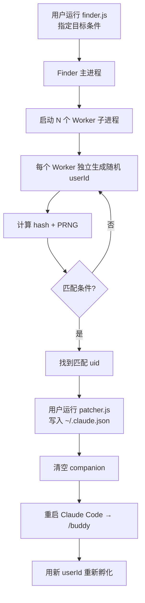
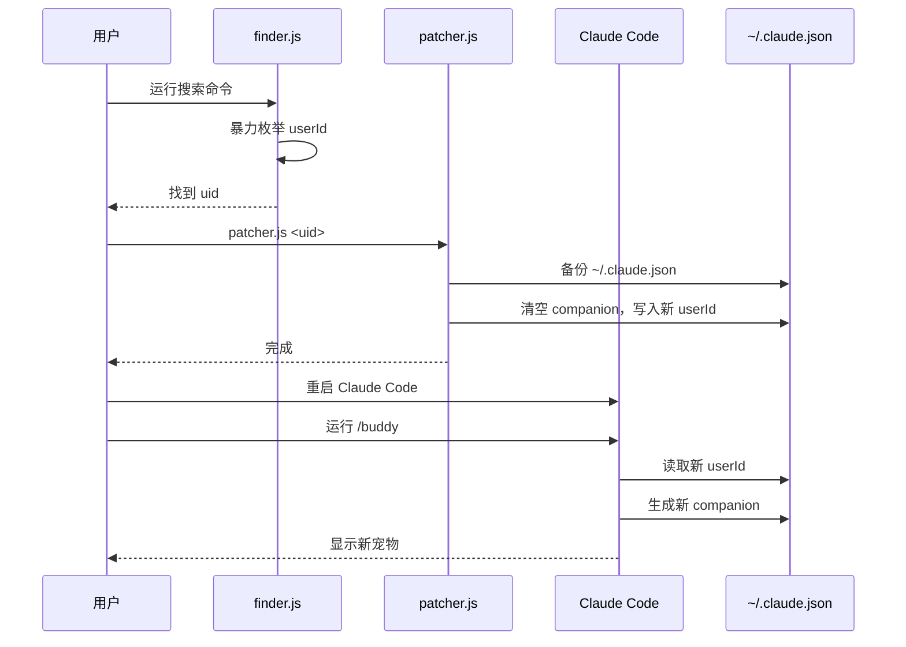

# Claude Buddy Finder

刷 Claude Code `/buddy` 宠物的工具——暴力搜索匹配目标的 `userId`，注入配置，永久锁定你想要的宠物。

> 仅供学习与娱乐。刷出来的宠物没有实际价值，官方保留随时修改规则的权利。

## 原理

Claude Code 每次运行 `/buddy` 时，**从 `~/.claude.json` 读取 `userId`**，用以下链条确定性生成宠物：

```
~/.claude.json 中的 userId
  + salt "friend-2026-401"
  → FNV-1a hash
  → Mulberry32 PRNG
  → Companion (rarity, species, eye, hat, shiny, stats)
```

- `companionSoul`（名字、性格）会存入配置
- `CompanionBones`（rarity、species 等）每次从 `userId` 重新计算，**不持久化**

所以刷的本质是：**找一个能产生目标 companion 的 userId**，写入 `~/.claude.json` 并清空 `companion`，下次 `/buddy` 就会用新的 userId 重新孵化。

## 架构流程



## 安装

```bash
git clone https://github.com/YOUR_HANDLE/claude-buddy-finder.git
cd claude-buddy-finder
```

> 纯 JavaScript，无需 `npm install`，Node.js >= 16 即可运行。

## 使用方法

### macOS / Linux

```bash
# 搜索
node src/finder.js --rarity legendary --species cat

# 写入配置（uid 从上一步复制）
node src/patcher.js <uid>

# 重启 Claude Code → /buddy
```

或加入 PATH（可选）：

```bash
export PATH="$PATH:$(pwd)/src"
buddy-finder --rarity epic --shiny
```

### Windows

```cmd
:: 搜索
node src\finder.js --rarity legendary --species cat

:: 写入配置
node src\patcher.js <uid>

:: 重启 Claude Code → /buddy
```

## 搜索参数

| 参数 | 说明 | 可选值 |
|------|------|--------|
| `--rarity` | 稀有度 | `common` `uncommon` `rare` `epic` `legendary` |
| `--species` | 物种 | `duck` `goose` `blob` `cat` `dragon` `octopus` `owl` `penguin` `turtle` `snail` `ghost` `axolotl` `capybara` `cactus` `robot` `rabbit` `mushroom` `chonk` |
| `--eye` | 眼睛符号 | `·` `✦` `×` `◉` `@` `°` |
| `--hat` | 帽子 | `none` `crown` `tophat` `propeller` `halo` `wizard` `beanie` `tinyduck` |
| `--shiny` | 闪光（概率 1%） | （加此参数即要求闪光） |
| `--limit N` | 找到 N 个后停止（默认 1） | 数字 |
| `--workers N` | 并行 worker 数（默认 CPU 核数 - 1） | 数字 |

### 搜索示例

```bash
# legendary cat
node src/finder.js --rarity legendary --species cat

# shiny epic dragon（难度最高之一）
node src/finder.js --rarity epic --species dragon --shiny

# epic + crown hat，不限物种
node src/finder.js --rarity epic --hat crown

# 找到 3 个 legendary 后停止
node src/finder.js --rarity legendary --limit 3

# 指定 8 个 worker
node src/finder.js --rarity legendary --species cat --workers 8
```

**搜索速度**：约 **40万次/秒/核**。legendary 概率 1/100，epic 4/100。

## 完整流程



## 恢复原配置

如果刷完不满意，恢复备份：

```bash
cp ~/.claude.json.bak ~/.claude.json
# 重启 Claude Code
```

## 项目结构

```
claude-buddy-finder/
├── src/
│   ├── finder.js   # 并行暴力搜索 uid
│   └── patcher.js  # 写入 ~/.claude.json
├── README.md
├── LICENSE
└── package.json
```

## 本地工作流文件（永不推送）

以下文件仅存于本地，**不得提交**到远程仓库：

- `.claude/` — Claude Code 工作流配置（含 task.json、rules、agents）
- `AGENTS.md` — Agent 工作流文档

原因：包含项目内部协作信息，不适合公开。

## 相关

- Claude Code companion 源码：[src/buddy/companion.ts](https://github.com/anthropics/claude-code/blob/main/src/buddy/companion.ts)
